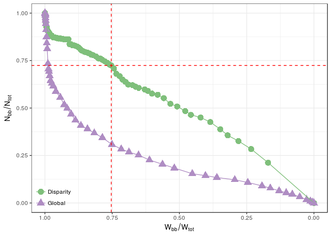

DisparityFilter
================
Gregorio Alanis-Lobato

Tools for the analysis, visualisation and filtering of complex undirected weighted networks.

Introduction
============

Complex systems can be represented as networks or graphs in which system components are abstracted as nodes and their interactions as edges connecting them. In addition, the strength or intensity of such interactions can be abstracted by an edge weight. For example, in an air-transportation network, the weight of an edge can be the number of yearly non-stop flights between two airports. In an online social network, on the other hand, the edge weight can be the number of messages shared by two friends.

Considering edge weights in complex networks is very important, as they convey the dynamics of information flowing through the network structure<sup>1</sup>, as well as the importance or reliability of edges<sup>2</sup>. As a result, the study of weighted networks is crucial to understand the formation, evolution and dynamics of complex systems. However, this kind of analyses has been hampered by the heterogeneity characterising the degree and weight distributions of weighted networks<sup>1,3</sup>. This heterogeneity can also be present at the local level, where only a few of the edges touching a node carry most of its strength (i.e. the total weight of the edges in which it takes part)<sup>4,5</sup>. This feature implies the lack of a characteristic scale and any global filter (i.e. removal of edges with weights below or above a certain cutoff) would overlook the information present above or below the arbitrary cutoff scale<sup>4</sup>.

Nevertheless, one can take advantage of the above-mentioned heterogeneities to filter out irrelevant edges and preserve a subnetwork comprised of the most salient connections between nodes<sup>5</sup>. To that end, Serrano *et al.* proposed a filtering method, **the disparity filter**, to extract the relevant backbone from a weighted network and, at the same time, retain most of its nodes, total weight, global connectedness, its small-world property, heterogeneous degree distribution and clustering<sup>4,5</sup>. This filter preserves the edges whose weight represents a statistically significant deviation from a null model. In the null, the normalised weights of the edges incident to a node of degree *k* are the result of a random assignment from a uniform distribution<sup>4</sup>.

If the strength of node *i* is *s*<sub>*i*</sub> = ∑<sub>*j*</sub>*w*<sub>*ij*</sub>, then the normalised weight of the edges linking *i* with its neighbours is *ω*<sub>*ij*</sub> = *w*<sub>*ij*</sub>/*s*<sub>*i*</sub> and ∑<sub>*j*</sub>*ω*<sub>*ij*</sub> = 1. Note that this normalisation happens at the level of each node, thus *ω*<sub>*ij*</sub> can be different from *ω*<sub>*ji*</sub>. One can now compare these normalised weights with the ones for node *i* in the null model, which represent random normalised weights that also sum up to 1. Given this null model, the probability of observing a particular normalised weight *x* touching a node with degree *k* is given by a beta distribution with shape parameters 1 and *k* − 1:

*p*(*x*)=(*k* − 1)(1 − *x*)<sup>*k* − 2</sup>

Salient edges, according to the disparity filter<sup>4</sup>, are thus those whose normalised weight satisfies the relation:

1 − (*k* − 1)∫<sub>0</sub><sup>*ω*<sub>*ij*</sub></sup>(1 − *x*)<sup>*k* − 2</sup>*dx* &lt; *α*

In other words, relevant edges have weights that are statistically different from what is expected by chance at the significance level *α*. Since *ω*<sub>*ij*</sub> can be different from *ω*<sub>*ji*</sub>, weights can be significant for node *i* but not for *j* and vice versa. The disparity filter keeps edge *ij* if it turns out to be relevant to either node. It is also worth noting that the beta distribution requires its shape parameters to be &gt;0, which means that nodes of degree 1 should be treated separately. With this package, the user can choose to always keep them or keep them only if their edge is significant to the node at the other end.

Package `DisparityFilter` is an implementation of the above-described identification of salient edges for complex undirected weighted networks, represented as `igraph` objects. It also allows for the visual analysis of the topological characteristics of networks filtered at different significance levels. What's more, it provides tools for the computation of node disparities<sup>4</sup>, defined as *Υ*<sub>*i*</sub>(*k*)=*k*∑<sub>*j*</sub>*ω*<sub>*ij*</sub><sup>2</sup> for a node *i* with degree *k*. Under perfect homogeneity, when all edges incident to *i* contribute equally to its strength, *Υ*<sub>*i*</sub>(*k*)=1 independently of *k*, while under perfect heterogeneity, when just one edge carries the whole strength, *Υ*<sub>*i*</sub>(*k*)=*k*.

Installation
============

1.  Install the `devtools` package from CRAN if you haven't done so:

``` r
install.packages("devtools")
```

1.  Load the `devtools` package:

``` r
library("devtools")
```

1.  Install `DisparityFilter` using the `install_github` function:

``` r
install_github("galanisl/DisparityFilter")
```

Usage
=====

To start using `DisparityFilter`, load the package:

``` r
library("DisparityFilter")
```

Let's now use the US air-transportation network included with `DisparityFilter`, analyse its node disparities and apply the disparity filter (for more details about this network type `?air` in R). Node disparities can be computed as follows:

``` r
disp <- get_node_disparity(net = air)
```

The relation between node degrees and node disparities can then be visualised with:

``` r
plot_degree_vs_disparity(net = air, node.disp = disp)
```


The above figure shows the disparity measure for individual nodes of the US airport network. Blue dashed lines represent perfect homogeneity and heterogeneity, the area below the red line represents the average plus two standard deviations of disparities given by the null model.

Let's now apply the disparity filter to the network to obtain the p-values associated to each edge:

``` r
edge.pvals <- get_edge_disparity_pvals(net = air)
```

We can now analyse the topology of the networks resulting from the application of different disparity filters:

``` r
analysis <- analyse_disparity_filter(net = air, disparity.pval = edge.pvals, breaks = 100)
```

Finally, based on the previous data frame, we can carry out a visual analysis of the resulting network topologies:

``` r
p <- plot_disparity_filter_analysis(disp.analysis = analysis)
```

The following plot shows the remaining fraction of nodes in the extracted backbone of `air` (*N*<sub>*bb*</sub>/*N*<sub>*tot*</sub>) as a function of the remaining fraction of links (*L*<sub>*bb*</sub>/*L*<sub>*tot*</sub>) as different significance levels are applied to the network. In addition, it shows the fractions resulting from the application of a global filter:

``` r
p$LvsN
```


In a similar fashion, the following plot shows the remaining fraction of nodes as a function of the remaining fraction of total weight (*W*<sub>*bb*</sub>/*W*<sub>*tot*</sub>):

``` r
p$WvsN
```



The dashed red lines in the above plots correspond to the significance level that maximises the number of remaining nodes in the network and minimises the average node degree<sup>5</sup>. Note how the disparity filter manages to retain as many nodes and as much weight as possible, whereas a global filter removes a high fraction of nodes and weight even for the less stringent cutoffs.

How to cite
===========

If you find this package useful, please cite the following publication:

-   Serrano M. A., Boguñá, M. & Vespignani, A. Extracting the multiscale backbone of complex weighted networks. *PNAS* **6**(16) 6483-6488 (2009) [See paper](http://www.pnas.org/content/106/16/6483.full)

References
==========

1. Barrat, A., Barthelemy, M., Pastor-Satorras, R. & Vespignani, A. The architecture of complex weighted networks. *Proceedings of the National Academy of Sciences of the United States of America* **101,** 3747–3752 (2004).

2. Alanis-Lobato, G., Andrade-Navarro, M. A. & Schaefer, M. H. HIPPIE v2.0: Enhancing meaningfulness and reliability of protein–protein interaction networks. *Nucleic Acids Research* **45,** D408–D414 (2017).

3. Allard, A., Serrano, M. Á., García-Pérez, G. & Boguñá, M. The geometric nature of weights in real complex networks. *Nature Communications* **8,** 14103 (2017).

4. Serrano, M. Á., Boguñá, M. & Vespignani, A. Extracting the multiscale backbone of complex weighted networks. *Proceedings of the National Academy of Sciences* **106,** 6483–6488 (2009).

5. García-Pérez, G., Boguñá, M., Allard, A. & Serrano, M. Á. The hidden hyperbolic geometry of international trade: World Trade Atlas 1870–2013. *Scientific Reports* **6,** 33441 (2016).
